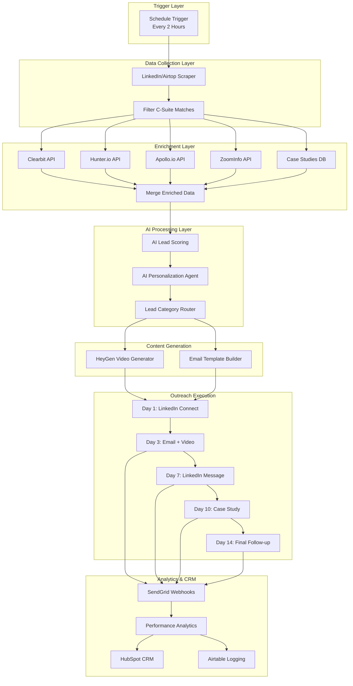
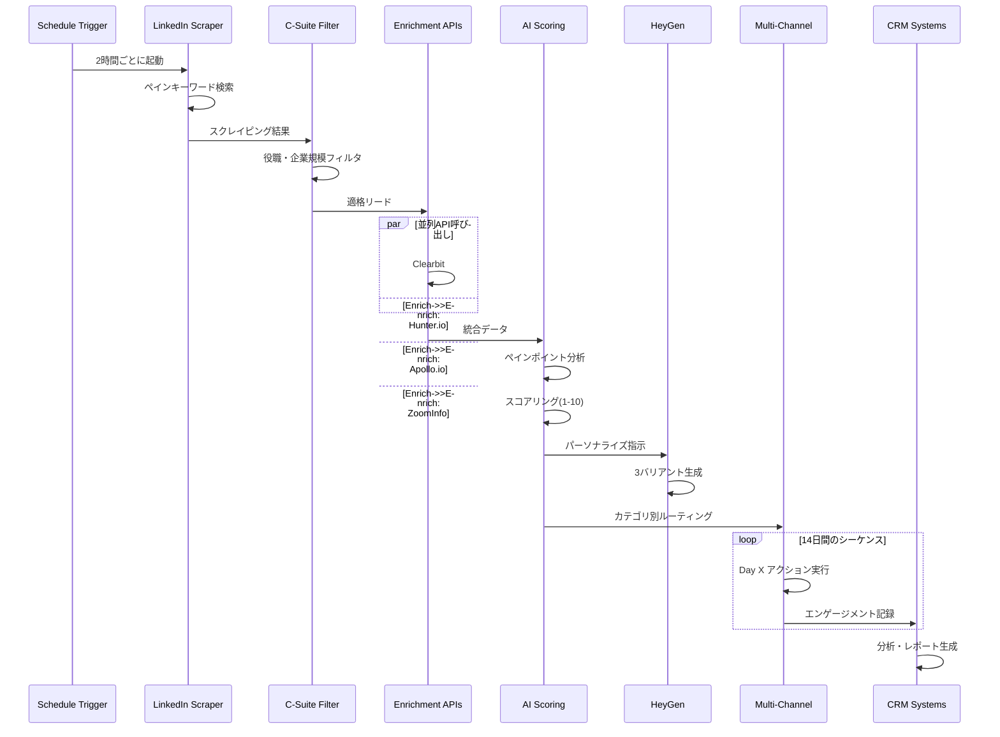
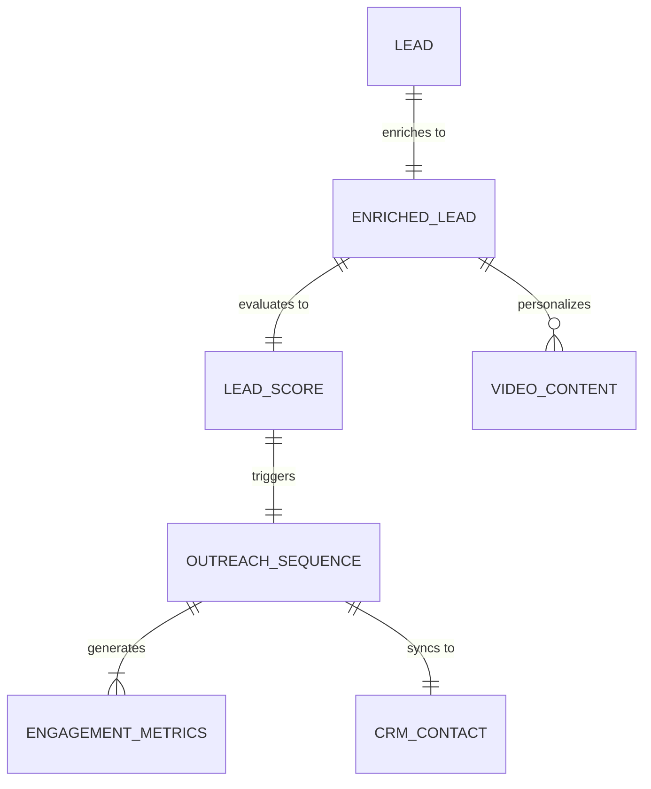
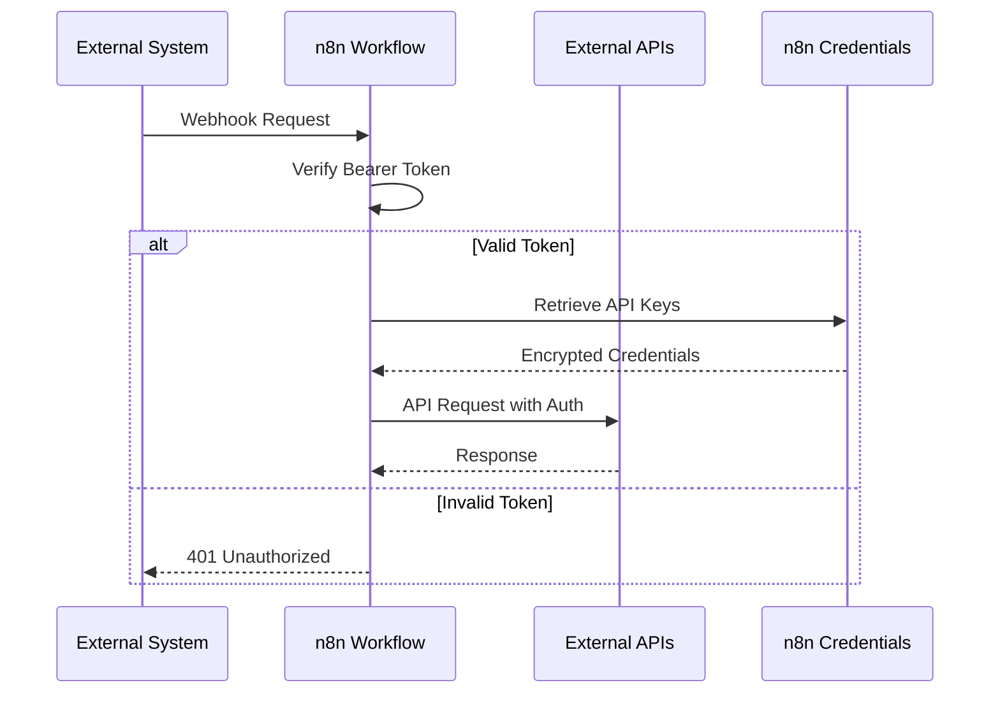
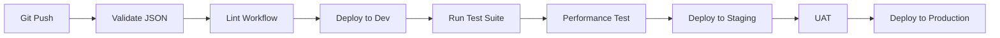

# Technical Design

## Overview

本設計書は、LinkedInからCスイート経営幹部層を自動的に特定し、マルチソースでのデータエンリッチメント、AI駆動のリード評価、パーソナライズビデオ生成、オムニチャネルアウトリーチを実行するn8nワークフローの技術設計を定義します。このシステムは、2時間ごとに自動実行され、1日あたり50〜100件の質の高いリードを生成し、ミーティング予約率2〜5%を目指します。

## Requirements Mapping

### Design Component Traceability

各設計コンポーネントは以下の要件に対応します：

- **LinkedIn Scraper Module** → REQ-1.1〜1.8: LinkedInリード発掘と自動ターゲティング
- **Data Enrichment Pipeline** → REQ-2.1〜2.8: マルチソースデータエンリッチメント
- **AI Scoring Engine** → REQ-3.1〜3.9: AI駆動のリード評価とスコアリング
- **Video Generation Service** → REQ-4.1〜4.8: パーソナライズビデオコンテンツ生成
- **Outreach Orchestrator** → REQ-5.1〜5.8: オムニチャネルアウトリーチの実行
- **Analytics Tracker** → REQ-6.1〜6.9: パフォーマンス追跡とCRM統合
- **Compliance Manager** → REQ-7.1〜7.5: コンプライアンスとデータセキュリティ

### User Story Coverage

- **マーケティング担当者のニーズ**: 自動LinkedInスクレイピング、ビデオ生成、パフォーマンス分析モジュールで対応
- **営業担当者のニーズ**: データエンリッチメント、オムニチャネルアウトリーチ、CRM統合で対応
- **営業マネージャーのニーズ**: AI駆動のリード評価、パフォーマンストラッキング、週次レポート生成で対応
- **コンプライアンス担当者のニーズ**: GDPR準拠モジュール、監査ログ、データ暗号化で対応

## Architecture

### n8n Workflow Architecture



### Technology Stack

- **Workflow Engine**: n8n v1.x (最新安定版)
- **External APIs**: 
  - LinkedIn/Airtop (スクレイピング)
  - Clearbit (企業情報)
  - Hunter.io (メール発見)
  - Apollo.io (インテントデータ)
  - ZoomInfo (競合分析)
  - HeyGen (ビデオ生成)
  - SendGrid (メール配信)
- **AI Models**: OpenRouter (Claude/GPT-4) via n8n AI nodes
- **Database**: 
  - Airtable (リードトラッキング、ケーススタディ)
  - HubSpot (CRM統合)
- **Authentication**: n8n Credentials Store (全API認証情報)
- **Monitoring**: n8n内蔵の実行ログとWebhookベースの外部監視

### Architecture Decision Rationale

- **なぜn8n**: ノーコード/ローコードで複雑なワークフローを構築でき、豊富な統合オプションとエラーハンドリング機能を提供
- **なぜ並列API呼び出し**: データエンリッチメントの時間を最小化し、2時間のサイクル内で処理を完了
- **なぜAirtable + HubSpot**: Airtableは柔軟なデータ構造で実験的なトラッキングに適し、HubSpotは成熟したCRM機能を提供
- **なぜOpenRouter**: 複数のAIモデルへの統一的なアクセスと、コスト効率的な利用が可能

## Data Flow

### Primary User Flow: リード処理フロー



## Components and Interfaces

### n8n Node Components

#### 1. トリガー・スケジューリング
| Node Type | Node Name | Purpose | Configuration |
|-----------|-----------|---------|---------------|
| n8n-nodes-base.scheduleTrigger | Every 2 Hours Trigger | 2時間ごとの自動実行 | `cronExpression: "0 */2 * * *"` |

#### 2. LinkedInスクレイピング
| Node Type | Node Name | Purpose | Parameters |
|-----------|-----------|---------|------------|
| n8n-nodes-base.httpRequest | Airtop Scraper API | LinkedIn検索実行 | `method: POST`, `url: airtop.com/api/scrape` |
| n8n-nodes-base.function | Parse LinkedIn Results | 投稿データ解析 | カスタムJS関数 |
| n8n-nodes-base.if | Filter C-Suite Only | 役職フィルタリング | `conditions: title IN [CEO,CTO,CDO]` |

#### 3. データエンリッチメント
| Node Type | Node Name | Purpose | Credentials |
|-----------|-----------|---------|-------------|
| n8n-nodes-base.httpRequest | Clearbit Enrichment | 企業情報取得 | Clearbit API Key |
| n8n-nodes-base.httpRequest | Hunter.io Email Finder | メール発見 | Hunter.io API Key |
| n8n-nodes-base.httpRequest | Apollo Intent Data | インテント収集 | Apollo.io API Key |
| n8n-nodes-base.httpRequest | ZoomInfo Insights | 競合分析 | ZoomInfo API Key |
| n8n-nodes-base.merge | Merge Enriched Data | データ統合 | `mode: combine` |

#### 4. AI処理
| Node Type | Node Name | Purpose | Model |
|-----------|-----------|---------|-------|
| @n8n/n8n-nodes-langchain.openAi | AI Pain Analysis | ペインポイント特定 | GPT-4/Claude |
| n8n-nodes-base.function | Score Calculator | スコア計算(1-10) | カスタムロジック |
| @n8n/n8n-nodes-langchain.agent | Personalization Agent | パーソナライズ生成 | AI Agent + Tools |

#### 5. コンテンツ生成
| Node Type | Node Name | Purpose | API |
|-----------|-----------|---------|-----|
| n8n-nodes-base.httpRequest | HeyGen Video API | ビデオ生成 | HeyGen API |
| n8n-nodes-base.set | Email Template Builder | メールテンプレート | 動的フィールド設定 |

#### 6. アウトリーチ実行
| Node Type | Node Name | Purpose | Integration |
|-----------|-----------|---------|-------------|
| n8n-nodes-base.httpRequest | LinkedIn Connection API | 接続リクエスト | LinkedIn API |
| n8n-nodes-base.sendGrid | SendGrid Email | メール送信 | SendGrid |
| n8n-nodes-base.wait | Day Sequencer | タイミング制御 | `unit: days` |

#### 7. 分析・CRM
| Node Type | Node Name | Purpose | System |
|-----------|-----------|---------|---------|
| n8n-nodes-base.webhook | SendGrid Event Webhook | イベント受信 | Webhook |
| n8n-nodes-base.hubspot | HubSpot Contact Upsert | CRM更新 | HubSpot |
| n8n-nodes-base.airtable | Airtable Logger | ログ記録 | Airtable |

### API Endpoints

本ワークフローは外部APIを消費しますが、以下のWebhookエンドポイントを公開します：

| Method | Route | Purpose | Auth | Status Codes |
|--------|-------|---------|------|--------------|
| POST | /webhook/sendgrid-events | SendGridイベント受信 | Bearer Token | 200, 401, 500 |
| GET | /webhook/performance-report | パフォーマンスレポート取得 | API Key | 200, 401, 500 |
| POST | /webhook/manual-trigger | 手動実行トリガー | API Key | 201, 401, 500 |

## Data Models

### Domain Entities

1. **Lead**: LinkedInから収集したリード情報
2. **EnrichedLead**: エンリッチメント後の完全なリード情報
3. **LeadScore**: AI評価とスコアリング結果
4. **OutreachSequence**: アウトリーチシーケンスの状態
5. **EngagementMetrics**: エンゲージメント追跡データ

### Entity Relationships



### Data Model Definitions

```typescript
interface Lead {
  id: string;
  linkedinUrl: string;
  name: string;
  title: string;
  company: string;
  companySize: string;
  painKeywords: string[];
  engagementScore: number;
  scrapedAt: Date;
}

interface EnrichedLead extends Lead {
  email: string;
  emailConfidence: number;
  companyDetails: {
    industry: string;
    revenue: string;
    techStack: string[];
    fundingStage: string;
  };
  intentSignals: string[];
  competitors: string[];
  caseStudyMatch: string;
}

interface LeadScore {
  leadId: string;
  painSeverity: number; // 1-10
  budgetAuthority: number; // 1-10
  timeline: number; // 1-10
  readiness: number; // 1-10
  totalScore: number; // 1-10
  category: 'hot' | 'warm' | 'cold';
  topPainPoints: string[];
  suggestedSolution: string;
}

interface OutreachSequence {
  leadId: string;
  currentDay: number;
  status: 'active' | 'completed' | 'opted-out';
  videoUrls: string[];
  emailsSent: number;
  linkedinMessagesSent: number;
  lastActionDate: Date;
}
```

### Airtable Schema

```sql
-- Leads Table
CREATE TABLE leads (
  id TEXT PRIMARY KEY,
  linkedin_url TEXT UNIQUE,
  name TEXT,
  title TEXT,
  company TEXT,
  email TEXT,
  score INTEGER,
  category TEXT,
  created_at TIMESTAMP,
  updated_at TIMESTAMP
);

-- Outreach Activities Table
CREATE TABLE outreach_activities (
  id TEXT PRIMARY KEY,
  lead_id TEXT REFERENCES leads(id),
  activity_type TEXT, -- 'email', 'linkedin', 'video'
  activity_date TIMESTAMP,
  response_received BOOLEAN,
  engagement_score INTEGER
);

-- Performance Metrics View
CREATE VIEW weekly_performance AS
SELECT 
  COUNT(DISTINCT lead_id) as total_leads,
  AVG(CASE WHEN response_received THEN 1 ELSE 0 END) as response_rate,
  COUNT(CASE WHEN activity_type = 'email' THEN 1 END) as emails_sent,
  COUNT(CASE WHEN activity_type = 'video' THEN 1 END) as videos_created
FROM outreach_activities
WHERE activity_date >= CURRENT_DATE - INTERVAL '7 days';
```

## Error Handling

### ワークフローレベルのエラーハンドリング

1. **API呼び出しエラー**
   - すべてのHTTP Requestノードで`continueOnFail: true`を設定
   - リトライ設定: `maxTries: 3, waitBetweenTries: 2000`
   - エラー時は代替データソースまたはデフォルト値を使用

2. **LinkedIn スクレイピングエラー**
   ```javascript
   // Function Node: Handle Scraping Errors
   if ($json.error || !$json.data) {
     return [{
       json: {
         error: true,
         message: "LinkedIn scraping failed",
         fallback: "use_cached_data",
         timestamp: new Date().toISOString()
       }
     }];
   }
   ```

3. **AI処理エラー**
   - AIノードの後にIFノードでエラーチェック
   - エラー時はデフォルトスコア(5)を割り当て
   - エラーログをAirtableに記録

4. **ビデオ生成エラー**
   - HeyGen APIエラー時はテキストベースの代替コンテンツを使用
   - 3回リトライ後も失敗時はビデオなしで進行

## Security Considerations

### Authentication & Authorization



### Data Protection

1. **API Key Management**
   - すべてのAPIキーはn8n Credentials Storeに保存
   - 環境変数での追加設定: `N8N_ENCRYPTION_KEY`
   - ワークフローJSON内にハードコードされたキーは禁止

2. **個人データ保護**
   - EUリード検出時のGDPRフラグ設定
   - 暗号化されたAirtableフィールドでPII保存
   - 30日後の自動データ削除ワークフロー

3. **監査ログ**
   ```javascript
   // Function Node: Audit Logger
   const auditLog = {
     timestamp: new Date().toISOString(),
     workflowId: $workflow.id,
     executionId: $execution.id,
     action: "lead_enrichment",
     userId: $json.leadId,
     ipAddress: $webhook?.headers['x-forwarded-for'],
     result: "success"
   };
   // Send to secure logging endpoint
   ```

## Performance & Scalability

### Performance Targets

| Metric | Target | Measurement |
|--------|--------|-------------|
| ワークフロー実行時間 (p95) | < 5分 | 全体の処理時間 |
| API応答時間 (p99) | < 2秒 | 個別API呼び出し |
| 並列処理スループット | > 50 leads/実行 | バッチ処理能力 |
| ビデオ生成時間 | < 60秒/video | HeyGen API |
| エラー率 | < 5% | 失敗した実行の割合 |

### 最適化戦略

1. **バッチ処理**
   ```javascript
   // Split In Batches Node設定
   {
     "batchSize": 10,
     "options": {
       "reset": false
     }
   }
   ```

2. **並列API呼び出し**
   - Clearbit、Hunter.io、Apollo.io、ZoomInfoを同時実行
   - Mergeノードで結果を統合

3. **キャッシング**
   - ケーススタディデータを`staticData`に24時間キャッシュ
   - 企業情報の重複チェックと再利用

4. **スケーリング**
   - n8nワーカーの水平スケーリング
   - 実行キューの分散処理
   - ピーク時の自動スケールアウト

## Testing Strategy

### Test Coverage Requirements

- **ユニットテスト**: Function/Setノードのカスタムロジック - 90%カバレッジ
- **統合テスト**: 外部API連携の動作確認 - 全APIエンドポイント
- **E2Eテスト**: 完全なリード処理フロー - メインシナリオ3パターン
- **負荷テスト**: 100リード同時処理のパフォーマンス検証

### n8nワークフローテスト手法

1. **テストモード実行**
   - n8nエディタでの手動実行とデバッグ
   - テストWebhookでのトリガー検証
   - モックデータでの各ノード単体テスト

2. **外部APIモック**
   ```javascript
   // Function Node: API Mock Switch
   const USE_MOCK = $workflow.staticData.testMode || false;
   
   if (USE_MOCK) {
     return [{
       json: {
         // モックレスポンスデータ
         email: "test@example.com",
         confidence: 0.95
       }
     }];
   }
   ```

3. **検証ポイント**
   - 各APIのレート制限内での動作
   - エラー時のフォールバック動作
   - データ変換の正確性
   - タイミング制御の精度

### CI/CD Pipeline



### ワークフロー品質チェックリスト

- [ ] workflow.md v2025.7準拠の確認
- [ ] 全ノードにtypeVersion最新版使用
- [ ] credentialsがID参照形式
- [ ] エラーハンドリング実装
- [ ] 日本語でのnotes/Sticky Note記載
- [ ] パフォーマンス目標の達成
- [ ] セキュリティ要件の実装