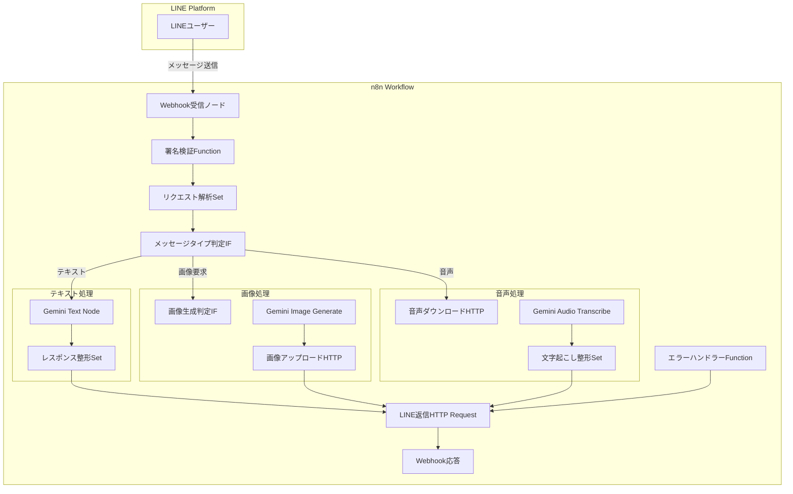
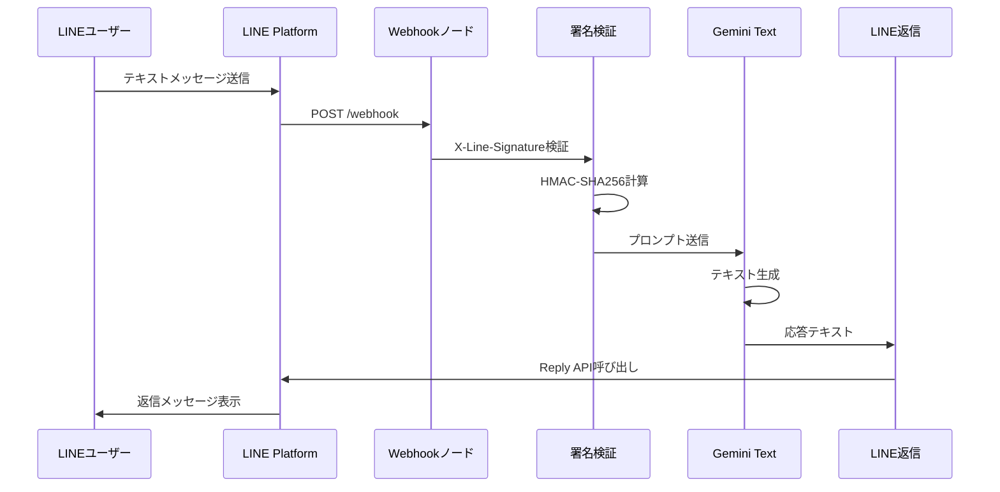
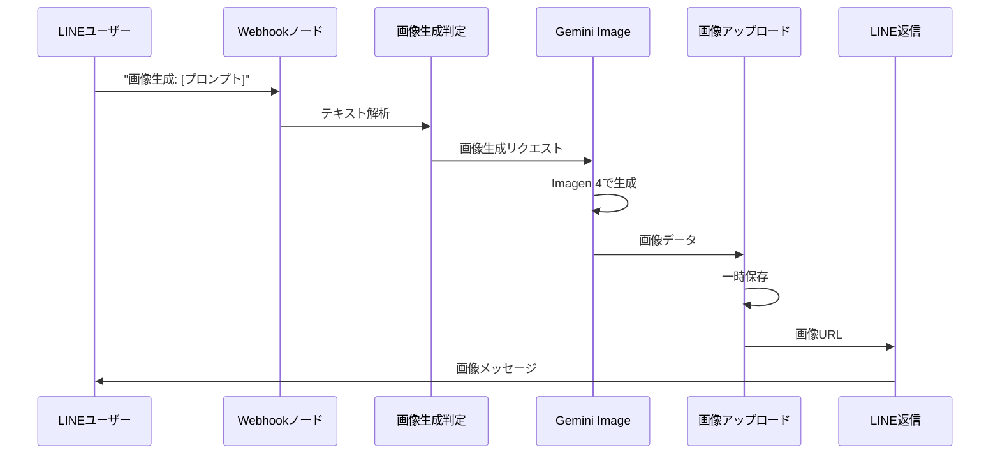
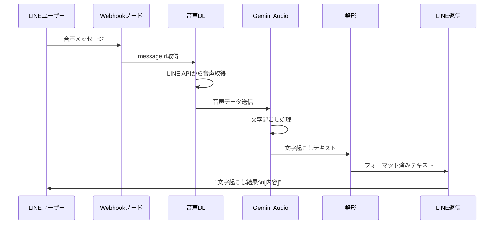
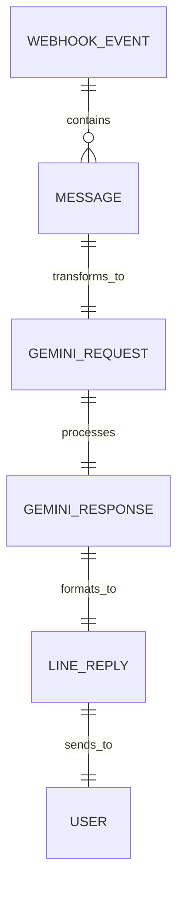
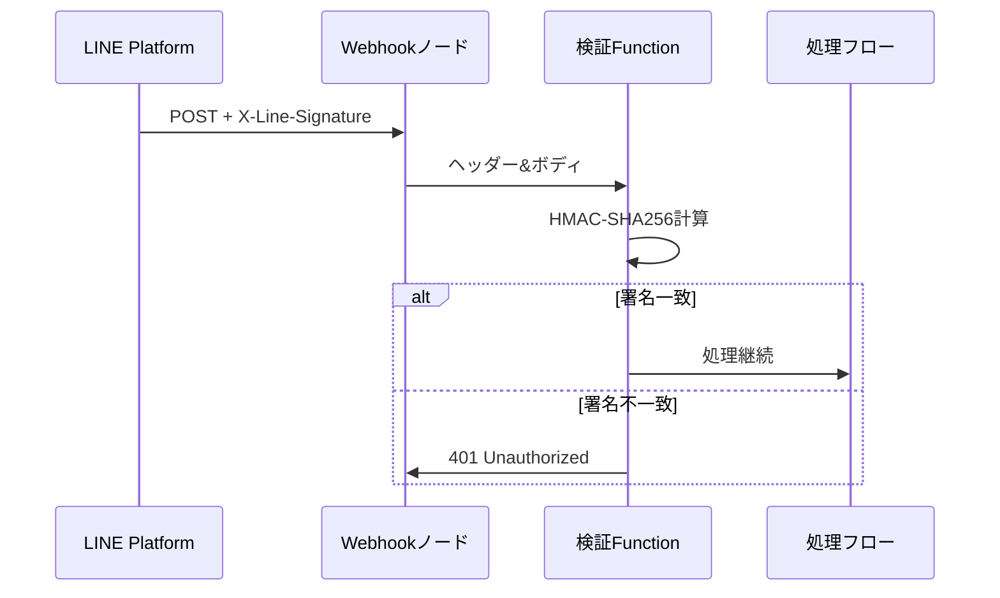
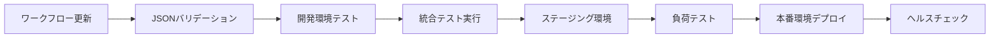

# Technical Design

## Overview

本技術設計は、LINE Messaging APIとGoogle Gemini AIを統合したマルチモーダルAIボットをn8nワークフローとして実装するための詳細な設計書です。ユーザーからのテキスト、画像、音声メッセージに対して、Gemini AIの高度な処理能力を活用し、自然な対話、画像生成、音声文字起こしを提供します。

## Requirements Mapping

### Design Component Traceability

各設計コンポーネントは以下の要件に対応しています：

- **Webhook受信ノード** → REQ-1: LINE Webhook受信と処理（署名検証、レスポンス管理）
- **メッセージタイプ判定ノード** → REQ-2: メッセージタイプの識別と振り分け
- **Geminiテキスト処理フロー** → REQ-3: Gemini AIテキストチャット機能
- **Gemini画像生成フロー** → REQ-4: Gemini AI画像生成機能
- **Gemini音声処理フロー** → REQ-5: Gemini AI音声文字起こし機能
- **エラーハンドラーノード** → REQ-6: エラーハンドリングとロギング
- **レート制限チェックノード** → REQ-7: パフォーマンスと制限

### User Story Coverage

- **User Story 1（Webhook受信）**: Webhookノードで署名検証を実装し、不正リクエストを自動的に拒否
- **User Story 2（メッセージ振り分け）**: IFノードでメッセージタイプを判定し、適切な処理フローへ分岐
- **User Story 3（テキストチャット）**: Gemini Native Nodeのtext resourceを使用して自然な対話を実現
- **User Story 4（画像生成）**: Gemini Native Nodeのimage generate機能で高品質な画像を生成
- **User Story 5（音声文字起こし）**: Gemini Native Nodeのaudio transcribe機能で正確な文字起こしを提供
- **User Story 6（エラー管理）**: 全ノードでcontinueOnFailを活用し、エラー時の適切な処理を実現
- **User Story 7（パフォーマンス）**: 並列処理とキューイングでレスポンス時間を最適化

## Architecture

n8nワークフローとして実装されるため、ノードベースのビジュアルプログラミングアーキテクチャを採用します。



### Technology Stack

調査結果に基づく技術スタック：

- **ワークフローエンジン**: n8n v1.x（最新安定版）
- **トリガー**: n8n Webhook Node v2
- **外部API連携**: HTTP Request Node v4
- **AI処理**: Google Gemini Native Node（@n8n/n8n-nodes-langchain）
- **データ処理**: Set Node v3, Function Node v1
- **条件分岐**: IF Node v3
- **認証**: LINE Channel Secret（HMAC-SHA256署名検証）
- **エラー処理**: continueOnFail設定、カスタムエラーハンドラー

### Architecture Decision Rationale

- **n8nワークフロー選択理由**: ビジュアル開発による保守性向上、組み込みのエラーハンドリング、スケーラビリティ
- **Gemini Native Node採用理由**: 最新のGemini 2.5モデルへのアクセス、マルチモーダル対応、高品質な日本語処理
- **Webhook + HTTP Request構成**: LINE APIの要件に最適、署名検証の柔軟な実装、レスポンス制御の自由度
- **Function Nodeでの署名検証**: n8n標準機能では不足するLINE特有の検証ロジックを実装可能

## Data Flow

### Primary User Flows

#### 1. テキストメッセージ処理フロー



#### 2. 画像生成処理フロー



#### 3. 音声文字起こし処理フロー



## Components and Interfaces

### n8nノード構成と設定

#### 1. Webhook受信ノード
```json
{
  "name": "LINE Webhook受信",
  "type": "n8n-nodes-base.webhook",
  "typeVersion": 2,
  "parameters": {
    "path": "line-gemini-bot",
    "httpMethod": "POST",
    "responseMode": "responseNode"
  }
}
```

#### 2. 署名検証Functionノード
```javascript
// 署名検証処理
const crypto = require('crypto');
const channelSecret = $credentials.lineChannelSecret;
const body = JSON.stringify($input.item.json.body);
const signature = $input.item.json.headers['x-line-signature'];

const hash = crypto
  .createHmac('SHA256', channelSecret)
  .update(body)
  .digest('base64');

if (hash !== signature) {
  throw new Error('Invalid signature');
}

return [{json: $input.item.json.body}];
```

#### 3. メッセージタイプ判定IFノード
```json
{
  "conditions": {
    "string": [{
      "value1": "={{ $json.events[0].message.type }}",
      "operation": "equals",
      "value2": "text"
    }]
  }
}
```

### API Endpoints

| Method | Route | Purpose | Auth | Status Codes |
|--------|-------|---------|------|--------------|
| POST | /webhook/line-gemini-bot | LINE Webhook受信 | X-Line-Signature | 200, 401, 400, 500 |
| GET | https://api-data.line.me/v2/bot/message/{messageId}/content | 音声ファイル取得 | Bearer Token | 200, 401, 404 |
| POST | https://api.line.me/v2/bot/message/reply | メッセージ返信 | Bearer Token | 200, 400, 401, 429 |

### 外部サービス連携

#### LINE Messaging API
- **Channel Access Token**: 環境変数として管理
- **Channel Secret**: n8n Credentialsで安全に保管
- **エンドポイント**: api.line.me/v2/bot

#### Google Gemini API
- **API Key**: n8n Credentialsで管理
- **モデル**: gemini-2.5-pro（テキスト）、imagen-4（画像）
- **リージョン**: asia-northeast1（東京）

## Data Models

### Domain Entities

1. **LINEイベント**: Webhookで受信するイベントデータ
2. **メッセージ**: ユーザーからの入力と返信内容
3. **処理結果**: Gemini APIからの応答データ

### データ構造定義

#### LINE Webhookイベント
```typescript
interface LineWebhookEvent {
  destination: string;
  events: Array<{
    type: 'message' | 'follow' | 'unfollow';
    message?: {
      type: 'text' | 'image' | 'audio' | 'video' | 'file' | 'location' | 'sticker';
      id: string;
      text?: string;
      duration?: number;
    };
    timestamp: number;
    source: {
      type: 'user' | 'group' | 'room';
      userId: string;
    };
    replyToken: string;
  }>;
}
```

#### Gemini処理リクエスト
```typescript
interface GeminiRequest {
  model: string;
  prompt?: string;
  audioData?: Buffer;
  generationConfig?: {
    temperature: number;
    topK: number;
    topP: number;
    maxOutputTokens: number;
  };
}
```

#### LINE返信メッセージ
```typescript
interface LineReplyMessage {
  replyToken: string;
  messages: Array<{
    type: 'text' | 'image' | 'audio';
    text?: string;
    originalContentUrl?: string;
    previewImageUrl?: string;
  }>;
}
```

### ワークフロー内データフロー



## Error Handling

### エラーハンドリング戦略

#### 1. ノードレベルのエラー処理
```json
{
  "continueOnFail": true,
  "retryOnFail": true,
  "maxTries": 3,
  "waitBetweenTries": 2000
}
```

#### 2. カスタムエラーハンドラー
```javascript
// エラーハンドラーFunctionノード
const error = $input.item.error;
const errorType = error?.name || 'UnknownError';
const errorMessage = error?.message || 'エラーが発生しました';

// エラーログ記録
const logEntry = {
  timestamp: new Date().toISOString(),
  errorType,
  errorMessage,
  nodeId: $node.name,
  workflowId: $workflow.id,
  executionId: $execution.id
};

// ユーザー向けメッセージ生成
const userMessage = {
  type: 'text',
  text: getErrorMessage(errorType)
};

function getErrorMessage(type) {
  const messages = {
    'InvalidSignature': '不正なリクエストです',
    'GeminiAPIError': '申し訳ございません。現在AIサービスが利用できません',
    'RateLimitError': 'しばらくお待ちください',
    'AudioTooLarge': '音声ファイルが大きすぎます。5MB以下のファイルを送信してください',
    'UnsupportedMessageType': 'このメッセージタイプはサポートされていません'
  };
  return messages[type] || '申し訳ございません。エラーが発生しました';
}

return [{
  json: {
    log: logEntry,
    reply: userMessage
  }
}];
```

#### 3. サーキットブレーカーパターン
```javascript
// Staticデータでエラーカウント管理
const errorCount = $getWorkflowStaticData('errorCount') || 0;
const errorThreshold = 10;
const resetTime = 300000; // 5分

if (errorCount >= errorThreshold) {
  const lastError = $getWorkflowStaticData('lastErrorTime');
  if (Date.now() - lastError < resetTime) {
    throw new Error('Service temporarily unavailable');
  } else {
    $setWorkflowStaticData('errorCount', 0);
  }
}
```

## Security Considerations

### Authentication & Authorization

#### LINE署名検証フロー


### Data Protection

1. **入力検証**
   - すべての外部入力をサニタイズ
   - SQLインジェクション対策（該当なし）
   - XSS対策（HTMLエスケープ）

2. **認証情報管理**
   - Channel Secretはn8n Credentialsで暗号化保存
   - API Keyは環境変数で管理
   - ログに認証情報を出力しない

3. **通信セキュリティ**
   - すべての外部通信はHTTPS
   - Webhookエンドポイントは推測困難なパスを使用

### Security Best Practices

1. **最小権限の原則**
   - LINE Channel Access Tokenは必要最小限のスコープ
   - Gemini APIキーは本番環境専用

2. **監査ログ**
   - すべてのリクエストをログ記録
   - エラーと異常な動作を追跡

3. **レート制限**
   - ユーザーごとの制限実装
   - グローバルな制限設定

## Performance & Scalability

### Performance Targets

| Metric | Target | Measurement |
|--------|--------|-------------|
| Webhook応答時間 | < 1秒 | 200 OK返却まで |
| テキスト処理時間 | < 5秒 | エンドツーエンド |
| 画像生成時間 | < 15秒 | リクエストから返信まで |
| 音声処理時間 | < 10秒 | 5MB以下のファイル |
| 同時処理数 | 10件 | 並列実行ワークフロー |

### 最適化戦略

1. **並列処理**
   - 独立した処理は並列実行
   - 非同期処理でレスポンス高速化

2. **キャッシング**
   - 頻出の応答をStaticDataに保存
   - Gemini APIレスポンスの一時保存

3. **リソース管理**
   - ワークフロー実行タイムアウト: 60秒
   - メモリ使用量監視

### スケーリング計画

1. **垂直スケーリング**
   - n8nインスタンスのリソース増強
   - 実行ワーカー数の調整

2. **水平スケーリング**
   - 複数n8nインスタンスでの負荷分散
   - Webhookエンドポイントの分散

## Testing Strategy

### Test Coverage Requirements

- **ユニットテスト**: Function Node内のロジック（署名検証、エラーハンドリング）
- **統合テスト**: 外部API連携（LINE API、Gemini API）
- **E2Eテスト**: 完全なユーザーシナリオ
- **負荷テスト**: 同時10リクエストの処理

### Testing Approach

1. **n8nワークフローテスト**
   - テストWebhookでの動作確認
   - 各ノードの個別実行テスト
   - エラーケースのシミュレーション

2. **外部API モック**
   - LINE APIレスポンスのモック
   - Gemini APIのテスト環境利用

3. **シナリオテスト**
   - テキストメッセージ → AI応答
   - 画像生成リクエスト → 画像返信
   - 音声アップロード → 文字起こし返信

### デプロイメントパイプライン

