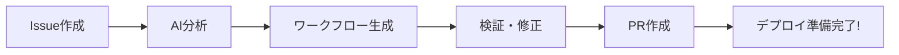

# 🚀 n8n AI ワークフロー自動生成システム

[](https://opensource.org/licenses/MIT)
[](https://www.anthropic.com)
[](https://n8n.io)

🤖 **自然言語からn8nワークフローを自動生成** - やりたいことを説明するだけで、本番環境で使えるワークフローが完成！

## 🚀 クイックスタート（5分で完了）

### ステップ1: このリポジトリをFork
右上の **Fork** ボタンをクリック → あなたのGitHubアカウントにコピー

### ステップ2: APIキーを設定
**あなたのForkしたリポジトリで**：
1. `Settings` → `Secrets and variables` → `Actions` へ移動
2. `New repository secret` をクリック
3. 追加: `ANTHROPIC_API_KEY` = あなたのClaude APIキー（[ここから取得](https://console.anthropic.com/)）

### ステップ3: 最初のワークフローを作成！
1. `Issues` → `New issue` へ移動
2. **「n8n Workflow Request」** テンプレートを選択
3. 日本語で要件を記述
4. Issueを送信
5. **重要**: コメントで `@claude` と入力して生成を開始
6. 約2分待つだけ ✨

## ✨ 主な特徴

- 📝 **自然言語対応**: 日本語・英語で要件を記述するだけ
- 🤖 **AI自動生成**: Claude 3が最適なワークフローを生成
- 🔧 **自己修復機能**: エラーを自動検出・修正
- ✅ **品質保証**: 自動検証とテスト
- 🚀 **高速開発**: 数時間の作業を**2分**に短縮
- 🌍 **オープンソース**: MIT ライセンス、永久無料

## 🎯 何が作れるの？

- 📬 **Webhook & API**: REST エンドポイント、データ処理
- 🤖 **AI チャットボット**: Discord、Slack、Telegram ボット（GPT/Claude対応）
- 📊 **データパイプライン**: ETL、データベース同期、レポート生成
- 🔄 **自動化**: スケジュールタスク、メール処理、通知
- 🔗 **統合**: 400以上のサービスを連携

## 🛠️ 動作の仕組み



1. **要件を記述** - Issueに日本語で説明
2. **AIが生成** - 完全なn8nワークフロー
3. **自動検証** - エラーを修正
4. **PR作成** - すぐ使えるワークフロー
5. **デプロイ** - n8nインスタンスへ

## 📋 リクエスト例

```markdown
以下のワークフローを作成してください：
1. Slackチャンネルを監視
2. 質問をgpt-5-mini-miniで処理
3. 回答をSlackに投稿
4. ログをデータベースに保存
```

**Issue送信後、コメントで `@claude` と入力して生成を開始！**

**結果**: 2分で完全なワークフローが完成！ 🎉

## 📚 詳細ドキュメント

- 🎯 [クイックスタートガイド](docs/QUICKSTART-jp.md)
- 💡 [実例集](docs/EXAMPLES-jp.md)
- ❓ [よくある質問](docs/FAQ-jp.md)
- 📖 [完全ガイド](docs/)

## 🆔 ワークフローID管理

### 既存ワークフローの編集

1. **ワークフローIDを見つける**：
   ```bash
   # n8n URLから: https://n8n.com/workflow/[これがID]
   # またはヘルパースクリプトを使用:
   node scripts/workflow-id-helper.js list
   ```

2. **編集リクエストを作成**：
   - Issues → New Issueへ移動
   - **「Edit Existing n8n Workflow」**テンプレートを選択
   - ワークフローIDを入力
   - 変更内容を記述

3. **ワークフローIDを追跡**：
   ```bash
   # デプロイ後にワークフローIDを設定
   node scripts/workflow-id-helper.js set workflows/my-workflow.json abCDE1f6
   
   # 名前でワークフローを検索
   node scripts/workflow-id-helper.js find "customer-onboarding"
   ```

[📄 ワークフローID完全ガイド](docs/WORKFLOW-ID-GUIDE.md)

## 🔧 上級者向け

### Forkしてからのカスタマイズ

Forkした後、以下のカスタマイズが可能：
- `.github/scripts/` でAIプロンプトを調整
- `workflow-spec.md` に独自ノードタイプを追加
- `scripts/validate-workflow.js` で検証ルールを変更
- カスタムIssueテンプレートを作成

### ローカル開発

```bash
# あなたのForkをクローン
git clone https://github.com/あなたのユーザー名/n8n-actions.git
cd n8n-actions

# 依存関係をインストール
npm install

# ローカルでワークフロー生成をテスト
export ANTHROPIC_API_KEY="your-key"
node .github/scripts/enhanced-workflow-generator.js
```

### 2. 依存関係のインストール

```bash
# npmを使用する場合
npm install

# yarnを使用する場合
yarn install
```

### 3. APIキーの取得

#### Anthropic Claude APIキー

1. [Anthropic Console](https://console.anthropic.com/)にアクセス
2. アカウントを作成またはログイン
3. 「API Keys」セクションで新しいキーを生成
4. 生成されたキーを安全に保管

#### n8n APIキー（オプション）

1. n8nインスタンスにログイン
2. 設定 → API設定
3. APIキーを生成

### 4. GitHubシークレットの設定

リポジトリの設定画面で以下のシークレットを追加：

1. **Settings** → **Secrets and variables** → **Actions**
2. **New repository secret**をクリック
3. 以下のシークレットを追加：

| シークレット名 | 値 | 説明 |
|--------------|-----|-----|
| `ANTHROPIC_API_KEY` | `sk-ant-xxx...` | Claude APIキー（必須） |
| `N8N_API_KEY` | `n8n_xxx...` | n8n APIキー（オプション） |
| `N8N_WEBHOOK_URL` | `https://your-n8n.com/webhook/xxx` | n8nのWebhook URL（オプション） |

### 5. GitHub Actionsの有効化

1. リポジトリの**Actions**タブへ移動
2. 「I understand my workflows, go ahead and enable them」をクリック
3. ワークフローが有効になったことを確認

### 6. 初期設定の確認

```bash
# 設定が正しいか確認
npm run check-setup

# または手動で確認
node scripts/check-configuration.js
```

## 使い方

### 方法1: GitHubのIssueから生成（推奨）

#### ステップ1: Issueを作成

1. リポジトリの**Issues**タブを開く
2. **New issue**をクリック
3. **「n8n Workflow Request」**テンプレートを選択
4. 必要事項を記入

#### ステップ2: Issueテンプレートの記入例

```markdown
### Workflow Name
顧客サポート自動化

### Workflow Description
お客様からの問い合わせを自動的に分類し、適切な担当者に振り分けるワークフロー

### Trigger Type
Webhook

### Required Integrations
- Gmail（メール受信）
- OpenAI gpt-5-mini（内容分析）
- Slack（通知）
- PostgreSQL（データ保存）

### Data Flow Specification
1. メールを受信
2. gpt-5-miniで内容を分析・カテゴリ分け
3. カテゴリに基づいて担当者を決定
4. Slackで担当者に通知
5. データベースに記録

### Required Features
[x] Error Handling
[x] Retry Logic
[x] Logging/Audit Trail
[x] Notifications on Failure

### Success Criteria
- 全てのメールが正しく分類される
- 5分以内に担当者に通知
- エラー率1%未満
```

#### ステップ3: 自動生成を待つ

1. Issueを送信すると、自動的にGitHub Actionsが起動
2. 1-2分でAIがワークフローを生成
3. 生成完了後、自動的にPull Requestが作成される
4. IssueにPRへのリンクがコメントされる

### 方法2: Pull Requestから修正・改善

既存のワークフローファイルを修正したい場合：

1. ワークフローファイル（`.json`）を編集
2. PRを作成
3. PR本文に改善指示を記載

```markdown
## AI生成指示

以下の改善を行ってください：
- エラーハンドリングを強化
- レート制限を追加
- パフォーマンスを最適化
```

### 方法3: コマンドラインから生成（上級者向け）

```bash
# 環境変数を設定
export ANTHROPIC_API_KEY="your-api-key"
export GENERATION_MODE="create"
export PR_BODY="Discordボットを作成してください。gpt-5-miniと連携し、質問に回答する機能を実装。"

# ワークフロー生成を実行
node .github/scripts/enhanced-workflow-generator.js

# 生成されたファイルを確認
cat generated_workflow.json
```

## ワークフロー生成方法

### 基本的なワークフロー

```yaml
要件: Webhookを受信してSlackに通知
↓
生成されるワークフロー:
- Webhookトリガー
- データ処理
- Slack通知
```

### AIエージェント

```yaml
要件: ChatGPTと連携したチャットボット
↓
生成されるワークフロー:
- チャットトリガー
- コンテキスト取得
- gpt-5-mini処理
- メモリ管理
- レスポンス返信
```

### データパイプライン

```yaml
要件: CSVをデータベースにインポート
↓
生成されるワークフロー:
- ファイル監視
- CSV解析
- データ検証
- バッチ処理
- DB保存
- 完了通知
```

## コマンド一覧

Issueのコメントで以下のコマンドが使用可能：

| コマンド | 説明 | 例 |
|---------|------|-----|
| `/regenerate` | ワークフローを再生成 | `/regenerate より詳細なエラーハンドリングを追加` |
| `/validate` | ワークフローを検証 | `/validate` |
| `/test` | テストを実行 | `/test サンプルデータで実行` |
| `/deploy staging` | ステージング環境にデプロイ | `/deploy staging` |
| `/deploy production` | 本番環境にデプロイ | `/deploy production` |
| `/rollback` | 前のバージョンに戻す | `/rollback v1.2.3` |
| `/help` | ヘルプを表示 | `/help` |

## トラブルシューティング

### よくある問題と解決方法

#### 1. APIキーエラー

```
Error: ANTHROPIC_API_KEY is not set
```

**解決方法**:
- GitHubシークレットが正しく設定されているか確認
- キーが有効期限内か確認
- スペースや改行が含まれていないか確認

#### 2. ワークフロー生成失敗

```
Workflow generation failed: Invalid structure
```

**解決方法**:
- Issueの要件をより具体的に記述
- 必須フィールドがすべて記入されているか確認
- 統合サービスの名前が正確か確認

#### 3. 検証エラー

```
Validation failed: Missing required fields
```

**解決方法**:
- 生成されたJSONファイルを手動で確認
- `saveDataSuccessExecution`と`saveDataErrorExecution`が文字列型か確認
- ノードIDの重複がないか確認

#### 4. GitHub Actions が起動しない

**解決方法**:
- Actionsタブで有効になっているか確認
- ワークフローファイルの構文エラーをチェック
- リポジトリの設定でActionsが許可されているか確認

### デバッグモード

詳細なログを出力する場合：

```bash
# 環境変数を設定
export DEBUG=true
export VERBOSE_LOGGING=true

# スクリプトを実行
node .github/scripts/enhanced-workflow-generator.js
```

## 高度な設定

### カスタムプロンプトテンプレート

`config/prompts.json`を作成して独自のプロンプトを定義：

```json
{
  "custom_patterns": {
    "ecommerce": {
      "system_prompt": "ECサイト専用のワークフローを生成",
      "nodes": ["payment", "inventory", "shipping"],
      "features": ["transaction", "refund", "tracking"]
    }
  }
}
```

### モデル選択の設定

```javascript
// config/models.js
module.exports = {
  // 複雑なワークフロー（30ノード以上）
  complex: 'claude-4-opus-20240229',
  
  // 標準的なワークフロー（推奨）
  standard: 'claude-4-sonnet-20241022',
  
  // シンプルなワークフロー
  simple: 'claude-4-haiku-20240307'
};
```

### バッチ処理

複数のワークフローを一度に生成：

```bash
# batch-generate.sh
#!/bin/bash

WORKFLOWS=(
  "customer-onboarding"
  "invoice-processing"
  "data-sync"
)

for workflow in "${WORKFLOWS[@]}"; do
  echo "Generating $workflow..."
  WORKFLOW_NAME=$workflow npm run generate
done
```

### ワークフローテンプレート

`templates/`ディレクトリにカスタムテンプレートを配置：

```json
{
  "name": "api-integration-template",
  "description": "API統合の基本テンプレート",
  "nodes": [
    {
      "type": "n8n-nodes-base.webhook",
      "position": [250, 300],
      "parameters": {
        "httpMethod": "POST",
        "path": "api-endpoint"
      }
    }
  ]
}
```

## パフォーマンス最適化

### 生成速度の改善

1. **キャッシュの活用**
   ```bash
   export USE_CACHE=true
   export CACHE_TTL=3600
   ```

2. **並列処理**
   ```bash
   export PARALLEL_GENERATION=true
   export MAX_WORKERS=4
   ```

3. **モデル選択の最適化**
   - シンプルなワークフロー → Haiku
   - 標準的なワークフロー → Sonnet
   - 複雑なワークフロー → Opus

## セキュリティ

### ベストプラクティス

1. **APIキーの管理**
   - 絶対にコードにハードコードしない
   - 定期的にローテーション
   - 最小権限の原則

2. **ワークフローの検証**
   - 自動生成されたコードを必ずレビュー
   - 本番環境へのデプロイ前にテスト
   - セキュリティスキャンの実施

3. **アクセス制御**
   - ブランチ保護ルールの設定
   - レビュー必須の設定
   - 環境ごとの権限管理

## 貢献方法

### バグ報告

1. Issueテンプレートを使用
2. 再現手順を明記
3. エラーログを添付

### 機能提案

1. Discussionsで議論
2. PRを作成
3. テストを追加

### ドキュメント改善

1. typoの修正歓迎
2. 使用例の追加
3. 翻訳の提供

## サポート

### コミュニティ

- [GitHub Discussions](https://github.com/heavenlykiss0820/n8n_CICD/discussions)
- [Discord サーバー](#)
- [Slack ワークスペース](#)

### 商用サポート

エンタープライズサポートが必要な場合はお問い合わせください。

## ライセンス

MIT License - 自由に使用・改変可能です。

## 謝辞

このプロジェクトは以下の技術に支えられています：

- [n8n](https://n8n.io/) - ワークフロー自動化プラットフォーム
- [Anthropic Claude](https://www.anthropic.com/) - AI言語モデル
- [GitHub Actions](https://github.com/features/actions) - CI/CDプラットフォーム

---

**開発者**: [@heavenlykiss0820](https://github.com/heavenlykiss0820)

**最終更新**: 2025年8月

🌟 このプロジェクトが役立ったら、スターをお願いします！