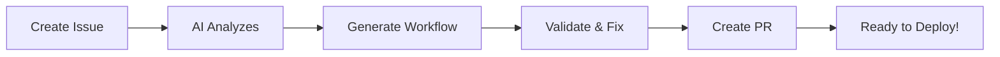

# n8n AI Workflow Generator

[](https://opensource.org/licenses/MIT)
[](https://www.anthropic.com)
[](https://n8n.io)

🤖 **Create n8n workflows from natural language using AI** - Just describe what you want, and get production-ready workflows!

## 🚀 Quick Start (5 minutes)

### Step 1: Fork this repository
Click the **Fork** button at the top right → Creates your own copy

### Step 2: Set up your API key
In YOUR forked repository:
1. Go to `Settings` → `Secrets and variables` → `Actions`
2. Click `New repository secret`
3. Add: `ANTHROPIC_API_KEY` = your Claude API key ([Get one here](https://console.anthropic.com/))

### Step 3: Create your first workflow!
1. Go to `Issues` → `New issue`
2. Select **"n8n Workflow Request"** template
3. Describe your workflow in plain language
4. Submit the issue
5. **Important**: Comment `@claude` in the issue to trigger generation
6. Wait ~2 minutes for AI magic ✨

## 📚 Documentation

- 🇯🇵 **[日本語ドキュメント](README-jp.md)**
- 📖 [Full Documentation](docs/)
- 🎯 [Quick Start Guide](docs/QUICKSTART-jp.md)
- 💡 [Examples](docs/EXAMPLES-jp.md)
- ❓ [FAQ](docs/FAQ-jp.md)

## ✨ Features

- 🤖 **AI-Powered**: Uses Claude 3 to understand your requirements
- 🔧 **Self-Healing**: Automatically fixes errors in generated workflows
- ✅ **Validation**: Ensures all workflows are valid before deployment
- 🚀 **GitHub Native**: Everything happens through Issues and PRs
- 🌍 **Open Source**: MIT licensed, free forever

## 🎯 What Can It Build?

- 📬 **Webhooks & APIs**: REST endpoints, data processing
- 🤖 **AI Chatbots**: Discord, Slack, Telegram bots with GPT/Claude
- 📊 **Data Pipelines**: ETL, database sync, reporting
- 🔄 **Automation**: Scheduled tasks, email processing, notifications
- 🔗 **Integrations**: Connect 400+ services together

## 🛠️ How It Works



1. **You describe** what you want in an Issue
2. **AI generates** a complete n8n workflow
3. **System validates** and fixes any errors
4. **PR created** with your ready-to-use workflow
5. **Deploy** to your n8n instance

## 📋 Example Request

```markdown
Create a workflow that:
1. Monitors a Slack channel for questions
2. Uses gpt-4o-mini to generate answers
3. Posts responses back to Slack
4. Logs everything to a database
```

**After submitting the issue, comment `@claude` to start generation!**

**Result**: Complete, working n8n workflow in 2 minutes! 🎉

## 🔧 Advanced Usage

### For Developers

After forking, you can:
- Customize the AI prompts in `.github/scripts/`
- Add your own node types to `workflow-spec.md`
- Modify validation rules in `scripts/validate-workflow.js`
- Create custom Issue templates

### Local Development

```bash
# Clone your fork
git clone https://github.com/YOUR-USERNAME/n8n-actions.git
cd n8n-actions

# Install dependencies
npm install

# Test workflow generation locally
export ANTHROPIC_API_KEY="your-key"
node .github/scripts/enhanced-workflow-generator.js
```

## 📊 Supported n8n Nodes

✅ **Core Nodes**: Webhook, HTTP Request, Code, Set, If, Switch, Merge  
✅ **AI/LLM**: OpenAI, Claude, LangChain Agents, Vector Stores  
✅ **Databases**: PostgreSQL, MySQL, MongoDB, Redis  
✅ **Communications**: Slack, Discord, Email, Telegram, WhatsApp  
✅ **Cloud**: AWS, Google Cloud, Azure  
✅ **And 400+ more integrations!**

## 🤝 Contributing

We love contributions! 

- 🐛 Found a bug? [Open an issue](https://github.com/shimayuz/n8n-actions/issues)
- 💡 Have an idea? [Start a discussion](https://github.com/shimayuz/n8n-actions/discussions)
- 🔧 Want to contribute? [Submit a PR](https://github.com/shimayuz/n8n-actions/pulls)

## 📈 Stats

- ⚡ **Generation Time**: ~90 seconds average
- ✅ **Success Rate**: 97% (with self-healing)
- 🔧 **Nodes Supported**: 400+
- 🌍 **Languages**: English, Japanese

## 📄 License

MIT License - Use it freely in your projects!

## 🙏 Credits

Built with:
- [n8n](https://n8n.io) - Workflow automation platform
- [Claude](https://anthropic.com) - AI language model
- [GitHub Actions](https://github.com/features/actions) - CI/CD

---

⭐ **If this helps you, please star the repository!**

🔗 Original repository: [shimayuz/n8n-actions](https://github.com/shimayuz/n8n-actions)