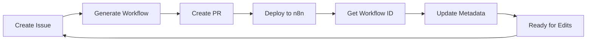

# 📋 n8n Workflow ID Management Guide

## Overview

When working with n8n workflows in this repository, you need to track workflow IDs to enable editing, updates, and proper version control. This guide explains how to find, manage, and use workflow IDs.

## What is a Workflow ID?

A workflow ID is a unique alphanumeric identifier (e.g., `abCDE1f6gHiJKL7`) that n8n assigns to each workflow when it's created or imported. This ID is visible in:
- The workflow URL: `https://your-n8n.com/workflow/abCDE1f6gHiJKL7`
- The workflow settings in n8n
- GitHub PR comments (after deployment)

## 🔍 How to Find Your Workflow ID

### Method 1: From n8n UI (Easiest)

1. Open your n8n instance
2. Navigate to the workflow you want to edit
3. Look at the URL in your browser
4. The ID is the last part: `https://n8n.com/workflow/[THIS-IS-THE-ID]`

### Method 2: Using the Helper Script

```bash
# List all workflows with their IDs
node scripts/workflow-id-helper.js list

# Find a specific workflow
node scripts/workflow-id-helper.js find "customer-onboarding"

# Extract ID from URL
node scripts/workflow-id-helper.js extract https://n8n.com/workflow/abCDE1f6gHiJKL7
```

### Method 3: From GitHub PR Comments

When a workflow is generated via GitHub Actions, the bot comments on the PR with:
- Workflow name
- n8n workflow ID
- Deployment status

## 📝 Setting Workflow IDs

After deploying a workflow to n8n, update the repository with its ID:

```bash
# Set ID using the actual ID
node scripts/workflow-id-helper.js set workflows/my-workflow.json abCDE1f6gHiJKL7

# Set ID using the n8n URL (automatically extracts ID)
node scripts/workflow-id-helper.js set workflows/my-workflow.json https://n8n.com/workflow/abCDE1f6gHiJKL7
```

## 🔧 Editing Existing Workflows

### Step 1: Find the Workflow ID

Use any of the methods above to get your workflow ID.

### Step 2: Create an Edit Issue

1. Go to Issues → New Issue
2. Select **"Edit Existing n8n Workflow"** template
3. Fill in:
   - Workflow ID (from Step 1)
   - Current workflow name
   - Desired changes
   - Test scenarios

### Step 3: Trigger AI Generation

After creating the issue, comment `@claude` to trigger the AI workflow editor.

## 📊 Workflow Metadata Structure

Each workflow JSON file can contain metadata in the `meta` field:

```json
{
  "name": "My Workflow",
  "nodes": [...],
  "connections": {...},
  "meta": {
    "n8nWorkflowId": "abCDE1f6gHiJKL7",
    "githubIssueId": "123",
    "githubPullRequest": "456",
    "deployedUrl": "https://n8n.com/workflow/abCDE1f6gHiJKL7",
    "lastUpdated": "2025-01-20T10:00:00Z",
    "description": "Customer onboarding automation",
    "version": "1.2.0"
  }
}
```

## 🔄 Workflow Lifecycle



## 📋 Best Practices

### Always Track IDs
- Update workflow metadata immediately after deployment
- Include workflow IDs in PR descriptions
- Document ID mappings in your team wiki

### Version Control
- Use semantic versioning in metadata
- Track changes in PR descriptions
- Keep a changelog for major workflows

### Organization
- Use consistent naming conventions
- Group related workflows in directories
- Maintain a workflow registry

## 🛠️ Helper Script Commands

| Command | Description | Example |
|---------|-------------|---------|
| `list` | Show all workflows with IDs | `node scripts/workflow-id-helper.js list` |
| `find <search>` | Search by name/ID/file | `node scripts/workflow-id-helper.js find "slack"` |
| `set <file> <id>` | Set workflow ID | `node scripts/workflow-id-helper.js set file.json abc123` |
| `extract <url>` | Extract ID from URL | `node scripts/workflow-id-helper.js extract https://...` |

## 🔍 Troubleshooting

### Can't Find Workflow ID?

1. Check if the workflow is actually deployed to n8n
2. Look in the original PR comments
3. Search by workflow name using the helper script
4. Check the n8n UI directly

### ID Not Updating?

1. Ensure you have write permissions
2. Check that the JSON file is valid
3. Verify the file path is correct
4. Try using absolute paths

### Multiple Workflows with Same Name?

1. Use file paths to distinguish
2. Add unique identifiers to workflow names
3. Use the metadata description field

## 🔗 Related Documentation

- [GitHub Integration Guide](./n8n-workflow-docs/github-integration.md)
- [AI Compiler Reference](./n8n-workflow-docs/ai-compiler-reference.md)
- [Workflow Examples](./EXAMPLES-jp.md)

## 💡 Tips

- **Bulk Updates**: Use a script to update multiple workflow IDs at once
- **CI/CD Integration**: Automatically capture IDs during deployment
- **Backup**: Always backup workflows before editing
- **Testing**: Test edited workflows in a development environment first

---

## Example Workflow

1. **Initial Creation**
   ```bash
   # Create workflow via Issue
   # AI generates workflow
   # PR #123 created
   ```

2. **Deployment**
   ```bash
   # Deploy to n8n
   # Get ID: abCDE1f6gHiJKL7
   ```

3. **Update Metadata**
   ```bash
   node scripts/workflow-id-helper.js set workflows/my-flow.json abCDE1f6gHiJKL7
   ```

4. **Later Edits**
   ```bash
   # Create edit issue
   # Reference ID: abCDE1f6gHiJKL7
   # AI updates workflow
   ```

## 📧 Support

If you encounter issues with workflow ID management:

1. Check this guide first
2. Run the helper script diagnostics
3. Create an issue with the `workflow-id-help` label
4. Include your workflow file and error messages