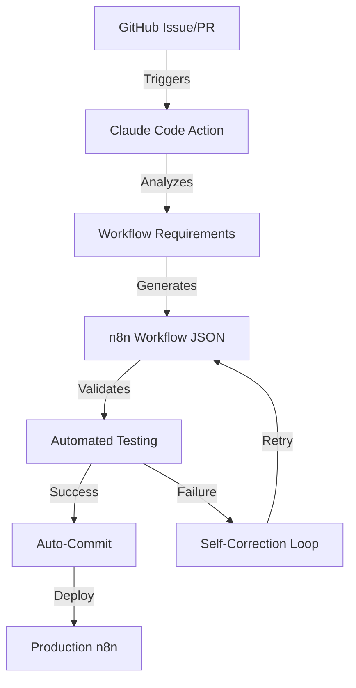

# n8n Workflow Development Documentation Hub

## 🚀 Complete Automation Pipeline

This documentation hub powers the complete GitHub-based n8n workflow automation system, combining Claude Code Actions, GitHub Issues/PRs, and intelligent workflow generation.

## 📚 Documentation Structure

### Core Documents
- [Workflow Specification Guide](./workflow-specification.md) - n8n workflow JSON structure and requirements
- [AI Compiler Reference](./ai-compiler-reference.md) - Claude-powered workflow generation rules
- [GitHub Integration Guide](./github-integration.md) - Issues, PRs, and automation workflows
- [Testing & Validation](./testing-validation.md) - Automated testing strategies
- [Deployment Pipeline](./deployment-pipeline.md) - CI/CD and production deployment

### Quick Start Guides
- [Developer Quickstart](./quickstart/developer.md) - Start developing in 5 minutes
- [Issue Template Guide](./quickstart/issue-templates.md) - Create perfect workflow requests
- [PR Workflow Guide](./quickstart/pr-workflow.md) - From PR to production

### Advanced Topics
- [Multi-Agent Orchestration](./advanced/multi-agent.md) - Complex workflow patterns
- [Error Recovery Patterns](./advanced/error-recovery.md) - Self-healing workflows
- [Performance Optimization](./advanced/performance.md) - Scale and optimize
- [Security Best Practices](./advanced/security.md) - Secure workflow development

## 🎯 Vision

Transform workflow development from manual coding to intelligent automation:

1. **Natural Language → Working Workflow**: Describe what you want, get production-ready n8n workflows
2. **Self-Correcting AI**: Automatically fix errors and optimize performance
3. **GitHub-Native**: Everything happens through Issues and PRs
4. **Enterprise-Grade**: Security, testing, and deployment built-in

## 🏗️ Architecture



## 🔧 Key Components

### 1. Intelligent Workflow Compiler
- Powered by Claude 3 Sonnet/Opus
- Understands n8n node ecosystem
- Self-correcting with retry logic
- Context-aware generation

### 2. GitHub Actions Orchestra
- Issue-triggered workflows
- PR-based development
- Automated validation
- Continuous deployment

### 3. Quality Assurance
- JSON structure validation
- Node connection verification
- Performance benchmarking
- Security scanning

### 4. Developer Experience
- Natural language specifications
- Visual workflow previews
- Real-time feedback
- Collaborative development

## 📈 Success Metrics

- **Time to Workflow**: From idea to production in < 10 minutes
- **Error Rate**: < 1% after self-correction
- **Developer Satisfaction**: 10x productivity increase
- **Automation Coverage**: 95% of standard workflows

## 🚦 Getting Started

1. **Setup Repository**
   ```bash
   git clone <your-repo>
   cd <your-repo>
   npm install
   ```

2. **Configure Secrets**
   - `ANTHROPIC_API_KEY`: Claude API access
   - `N8N_API_KEY`: n8n instance connection
   - `GITHUB_TOKEN`: Repository automation

3. **Create Your First Workflow**
   - Open an issue with workflow requirements
   - Watch AI generate and validate
   - Review and merge PR
   - Deploy to production

## 🤝 Contributing

We welcome contributions from the community! See [CONTRIBUTING.md](./CONTRIBUTING.md) for guidelines.

## 📄 License

MIT License - Build amazing things!

---

*Built with the vision of Tesla's rapid innovation and PayPal's scale, powered by 100k+ GitHub stars of experience.*