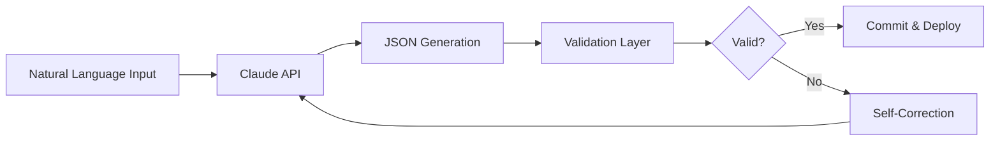

# AI Compiler Reference Guide

## Claude-Powered Workflow Generation System

### System Architecture



## Prompt Engineering Templates

### 1. Base System Prompt

```javascript
const SYSTEM_PROMPT = `
You are an expert n8n Workflow Automation System with deep knowledge of:
- All n8n node types and their parameters
- Workflow optimization patterns
- Error handling best practices
- Performance considerations

Your responses must be:
1. Valid JSON only (no markdown, no explanation)
2. Complete n8n workflow structure
3. Production-ready with error handling
4. Optimized for performance
`;
```

### 2. Workflow Generation Prompts

#### From Natural Language

```xml
<task>
Create an n8n workflow based on user requirements
</task>

<requirements>
${userRequirements}
</requirements>

<constraints>
- Use latest stable node versions
- Include error handling
- Optimize for performance
- Follow n8n best practices
</constraints>

<output_format>
Raw JSON object starting with { and ending with }
</output_format>
```

#### From Specification

```xml
<task>
Generate n8n workflow from formal specification
</task>

<specification>
${specificationContent}
</specification>

<technical_requirements>
- Node types: ${allowedNodeTypes}
- Max nodes: ${maxNodes}
- Execution timeout: ${timeout}
- Memory limit: ${memoryLimit}
</technical_requirements>
```

### 3. Self-Correction Prompts

```xml
<task>
Fix the following n8n workflow errors
</task>

<original_workflow>
${brokenWorkflow}
</original_workflow>

<errors>
${validationErrors}
</errors>

<fix_requirements>
- Maintain original intent
- Fix all structural errors
- Ensure valid connections
- Correct data types
</fix_requirements>
```

## AI Model Configuration

### Claude 3 Model Selection

```javascript
const MODEL_CONFIG = {
  // For complex workflows
  'claude-4-opus-20240229': {
    maxTokens: 8192,
    temperature: 0.3,
    use_case: 'Complex multi-node workflows'
  },
  
  // For standard workflows (recommended)
  'claude-4-sonnet-20241022': {
    maxTokens: 8192,
    temperature: 0.2,
    use_case: 'Standard workflows, best balance'
  },
  
  // For simple workflows
  'claude-4-haiku-20240307': {
    maxTokens: 4096,
    temperature: 0.1,
    use_case: 'Simple, fast generation'
  }
};
```

### Temperature Settings

- `0.0 - 0.2`: Deterministic, consistent outputs
- `0.3 - 0.5`: Balanced creativity and consistency
- `0.6 - 0.8`: Creative, varied solutions
- `0.9 - 1.0`: Highly creative, experimental

## Workflow Pattern Library

### 1. Data Processing Pipeline

```javascript
const DATA_PIPELINE_PATTERN = {
  trigger: 'webhook or schedule',
  stages: [
    'data_ingestion',
    'validation',
    'transformation',
    'enrichment',
    'storage',
    'notification'
  ],
  error_handling: 'continue_on_fail',
  monitoring: 'execution_logs'
};
```

### 2. AI Agent Workflow

```javascript
const AI_AGENT_PATTERN = {
  trigger: 'chat_message',
  components: [
    'context_retrieval',
    'prompt_construction',
    'llm_processing',
    'response_formatting',
    'memory_update'
  ],
  features: [
    'conversation_history',
    'tool_calling',
    'fallback_handling'
  ]
};
```

### 3. Integration Hub

```javascript
const INTEGRATION_PATTERN = {
  sources: ['api', 'database', 'file'],
  transformations: ['mapping', 'filtering', 'aggregation'],
  destinations: ['api', 'database', 'notification'],
  sync_type: 'real_time or batch'
};
```

## Node Generation Rules

### 1. Node ID Generation

```javascript
function generateNodeId() {
  return `node_${Date.now()}_${Math.random().toString(36).substr(2, 9)}`;
}

// Or use UUID v4
function generateUUID() {
  return 'xxxxxxxx-xxxx-4xxx-yxxx-xxxxxxxxxxxx'.replace(
    /[xy]/g, 
    function(c) {
      const r = Math.random() * 16 | 0;
      const v = c == 'x' ? r : (r & 0x3 | 0x8);
      return v.toString(16);
    }
  );
}
```

### 2. Position Calculation

```javascript
function calculateNodePosition(index, total) {
  const SPACING = 250;
  const START_X = 250;
  const START_Y = 300;
  const NODES_PER_ROW = 4;
  
  const row = Math.floor(index / NODES_PER_ROW);
  const col = index % NODES_PER_ROW;
  
  return [
    START_X + (col * SPACING),
    START_Y + (row * SPACING)
  ];
}
```

### 3. Connection Builder

```javascript
function buildConnection(sourceNode, targetNode, outputIndex = 0) {
  return {
    [sourceNode]: {
      main: [
        [{
          node: targetNode,
          type: "main",
          index: outputIndex
        }]
      ]
    }
  };
}
```

## Validation Pipeline

### 1. Structural Validation

```javascript
const STRUCTURAL_RULES = {
  required_fields: ['name', 'nodes', 'connections', 'settings'],
  node_required: ['id', 'name', 'type', 'position', 'parameters'],
  settings_types: {
    saveDataSuccessExecution: 'string',
    saveDataErrorExecution: 'string',
    saveExecutionProgress: 'boolean'
  }
};
```

### 2. Semantic Validation

```javascript
const SEMANTIC_RULES = {
  node_connections: 'all_referenced_nodes_must_exist',
  credential_references: 'must_match_configured_credentials',
  expression_syntax: 'valid_javascript_in_expressions',
  workflow_cycles: 'no_infinite_loops'
};
```

### 3. Performance Validation

```javascript
const PERFORMANCE_RULES = {
  max_nodes: 100,
  max_connections_per_node: 10,
  max_execution_time: 3600,
  max_memory_usage: '512MB'
};
```

## Error Recovery Strategies

### 1. Common Error Fixes

```javascript
const ERROR_FIXES = {
  'missing_id': () => generateUUID(),
  'invalid_position': (node, index) => calculateNodePosition(index, 1),
  'string_boolean_mismatch': (value) => value ? "all" : "none",
  'missing_connection': (node) => ({ [node.name]: { main: [] } }),
  'duplicate_id': () => generateUUID()
};
```

### 2. Self-Healing Patterns

```javascript
async function selfHeal(workflow, errors) {
  let fixed = { ...workflow };
  
  for (const error of errors) {
    switch(error.type) {
      case 'MISSING_FIELD':
        fixed[error.field] = getDefaultValue(error.field);
        break;
      case 'INVALID_TYPE':
        fixed[error.path] = convertType(error.value, error.expectedType);
        break;
      case 'BROKEN_CONNECTION':
        fixed.connections = repairConnections(fixed.connections, fixed.nodes);
        break;
    }
  }
  
  return fixed;
}
```

## Optimization Techniques

### 1. Workflow Optimization

```javascript
const OPTIMIZATION_RULES = {
  batch_processing: 'Group similar operations',
  parallel_execution: 'Use split/merge for parallelism',
  caching: 'Store frequently accessed data',
  rate_limiting: 'Implement delays for API calls',
  error_boundaries: 'Isolate failure points'
};
```

### 2. Performance Patterns

```javascript
const PERFORMANCE_PATTERNS = {
  lazy_loading: 'Load data only when needed',
  streaming: 'Process data in chunks',
  memoization: 'Cache computation results',
  debouncing: 'Limit execution frequency',
  circuit_breaking: 'Fail fast on repeated errors'
};
```

## Testing Strategies

### 1. Unit Testing Nodes

```javascript
async function testNode(node, inputData) {
  const context = createMockContext();
  const result = await executeNode(node, inputData, context);
  
  return {
    success: result.error === undefined,
    output: result.data,
    error: result.error,
    performance: result.executionTime
  };
}
```

### 2. Integration Testing

```javascript
async function testWorkflow(workflow, testCases) {
  const results = [];
  
  for (const testCase of testCases) {
    const execution = await runWorkflow(workflow, testCase.input);
    results.push({
      case: testCase.name,
      expected: testCase.expected,
      actual: execution.output,
      passed: deepEqual(testCase.expected, execution.output)
    });
  }
  
  return results;
}
```

## Deployment Configuration

### 1. Environment Variables

```bash
# AI Configuration
ANTHROPIC_API_KEY=sk-ant-xxx
CLAUDE_MODEL=claude-4-sonnet-20241022
MAX_RETRIES=3
RETRY_DELAY=1000

# n8n Configuration
N8N_API_URL=https://your-n8n.com/api
N8N_API_KEY=xxx
N8N_WEBHOOK_URL=https://your-n8n.com/webhook

# GitHub Configuration
GITHUB_TOKEN=ghp_xxx
AUTO_MERGE=true
REQUIRE_APPROVAL=false
```

### 2. CI/CD Pipeline

```yaml
deploy:
  stages:
    - validate
    - test
    - optimize
    - deploy
  
  validate:
    - json_syntax
    - n8n_structure
    - node_compatibility
  
  test:
    - unit_tests
    - integration_tests
    - performance_tests
  
  optimize:
    - remove_unused_nodes
    - optimize_connections
    - minify_expressions
  
  deploy:
    - backup_existing
    - upload_workflow
    - verify_deployment
    - rollback_on_failure
```

## Monitoring & Analytics

### 1. Metrics Collection

```javascript
const METRICS = {
  generation_time: 'Time to generate workflow',
  correction_attempts: 'Number of self-corrections',
  validation_errors: 'Types and frequency of errors',
  node_usage: 'Most commonly used nodes',
  workflow_complexity: 'Average nodes per workflow',
  success_rate: 'Successful generations / total'
};
```

### 2. Performance Tracking

```javascript
const PERFORMANCE_METRICS = {
  api_latency: 'Claude API response time',
  validation_time: 'Time to validate workflow',
  deployment_time: 'Time to deploy to n8n',
  execution_time: 'Workflow runtime',
  resource_usage: 'CPU/Memory consumption'
};
```

## Best Practices

1. **Always validate before deployment**
2. **Implement graceful error handling**
3. **Use descriptive node names**
4. **Document complex logic**
5. **Test with edge cases**
6. **Monitor resource usage**
7. **Version control workflows**
8. **Implement rollback mechanisms**
9. **Use environment variables for configuration**
10. **Regular performance audits**